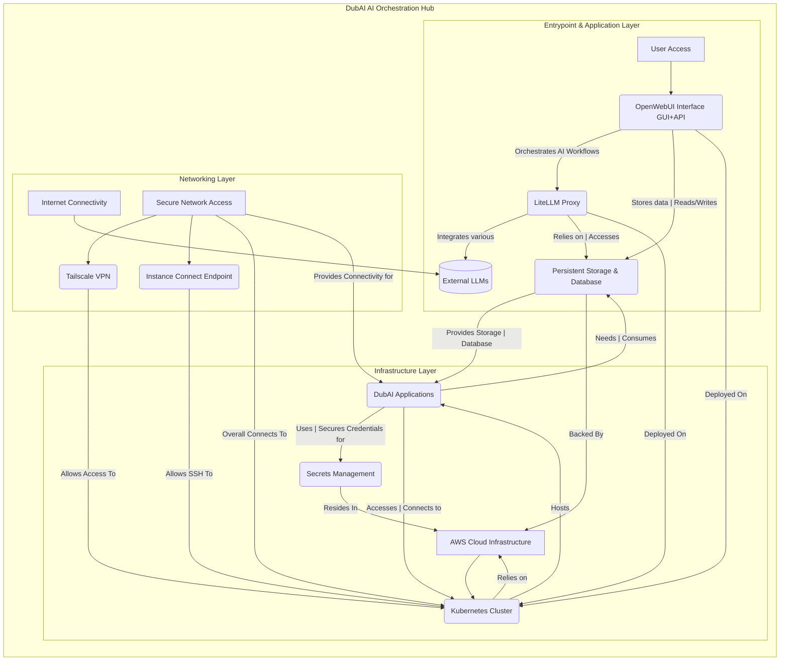

# High-Level Design Document: DubAI Project

## 1. Introduction

The DubAI Project is an AI Orchestration Hub designed for enterprises to rapidly deploy AI integrations. This document outlines the high-level architecture, key components, and their interactions.

## 2. Architecture Overview

The DubAI project leverages a robust, scalable, and automated cloud infrastructure built on AWS. It utilizes Kubernetes for container orchestration, ensuring flexibility and efficient resource management for AI workloads.

## 3. Key Components

### 3.1 Infrastructure Core

*   **AWS (us-west-2):** Primary cloud provider and region for all deployments.
*   **VPC (Virtual Private Cloud):** Isolated network environment in AWS with public and private subnets, and NAT Gateway for secure outbound connectivity.
*   **EC2 Auto Scaling Group:** Manages the lifecycle and scaling of K3s worker nodes.
*   **K3s Cluster (Kubernetes):** A lightweight Kubernetes distribution for container orchestration and workload management. Boostrapped via SSM and custom scripts.
*   **AWS Secrets Manager:** Centralized service for secure storage and management of API keys, database credentials, and other sensitive information.
*   **S3 Buckets:** Used for storing K3s configuration, OpenWebUI data, and other application-related object storage. Configured with server-side encryption.
*   **Longhorn:** Distributed block storage system for Kubernetes within the `longhorn-system` namespace, providing persistent storage for stateful applications.
*   **Aurora PostgreSQL:** Serverless v2 database for scalability and cost optimization, configured with auto-pause and restricted access via security groups.

### 3.2 Application Layer

*   **OpenWebUI:** A web-based user interface for interacting with Large Language Models (LLMs).
*   **LiteLLM:** A library that provides a unified API for various LLM providers, abstracting away differences in their APIs.
*   **Helm:** Package manager for Kubernetes, used for deploying and managing all application components (e.g., `tailscale-operator`, `longhorn`, `dubai-interface`).

### 3.3 Connectivity & Security

*   **Tailscale:** Provides secure mesh VPN connectivity, enabling secure access to internal services and the Kubernetes cluster.
*   **EC2 Instance Connect Endpoint (EICE):** Facilitates secure access to the router.
*   **IAM (Identity and Access Management):** Defines roles, policies, and instance profiles to manage permissions for AWS resources, adhering to least privilege principles.

### 3.4 Automation & Operations

*   **Terraform:** Infrastructure as Code (IaC) tool used to define, provision, and manage all AWS infrastructure components. Utilizes remote state in S3 for collaborative development and state management.
*   **SSM (Systems Manager):** Used for running scripts on EC2 instances, particularly for K3s bootstrapping, health checks, and general instance management.

## 4. Data Flow and Interactions

1.  **Infrastructure Provisioning:** Terraform provisions all underlying AWS resources, including VPC, subnets, EC2 ASG, Aurora PostgreSQL, S3 buckets, and Secrets Manager.
2.  **K3s Cluster Bootstrapping:** EC2 instances launched by the ASG use SSM and custom scripts (`k3s-bootstrap.sh`) to install and configure K3s, retrieve tokens from Secrets Manager, and upload kubeconfig to S3.
3.  **Application Deployment:** Helm charts are used to deploy core services onto the K3s cluster. This includes `tailscale-operator`, `longhorn`, `openwebui`, `litellm`, and other custom `dubai` charts.
4.  **Secrets Management:** Applications like OpenWebUI and LiteLLM retrieve sensitive information (LLM API keys, database credentials) from AWS Secrets Manager at runtime.
5.  **LLM Interaction:** Enterprise users interact with LLMs through the OpenWebUI. OpenWebUI communicates with LiteLLM, which in turn calls various LLM providers using the configured API keys.
6.  **Data Storage:** Persistent data for applications is stored on Longhorn volumes within Kubernetes, which can be backed up to S3. OpenWebUI also uses S3 for specific data storage.
7.  **Database Operations:** Applications interact with the Aurora PostgreSQL database for storing and retrieving structured data.
8.  **Secure Access:** Tailscale provides secure network access for enterprise users to connect to internal services and the Kubernetes cluster.

## 5. Scalability and Resilience

*   **Auto Scaling Group:** Ensures K3s worker nodes scale dynamically based on demand.
*   **K3s:** Lightweight Kubernetes provides inherent scalability and self-healing capabilities for containerized applications.
*   **Aurora Serverless v2:** PostgreSQL database automatically scales capacity based on application needs and can auto-pause when not in use to optimize costs.
*   **Longhorn:** Distributed storage provides resilience and data replication for persistent volumes.
*   **S3:** Highly available and durable object storage for critical data.

## 6. Security Considerations

*   **VPC Private Subnets:** Application components reside in private subnets, inaccessible directly from the internet.
*   **NAT Gateway:** Provides secure outbound internet access without exposing instances directly.
*   **AWS Secrets Manager:** Centralized and secure storage for credentials.
*   **IAM Least Privilege:** Roles and policies are designed to grant only necessary permissions.
*   **Tailscale:** Encrypted network connectivity for internal access.
*   **Server-Side Encryption:** Applied to S3 buckets for data at rest.
*   **Security Groups:** Control network access to PostgreSQL and other instances.

## 7. Future Enhancements

*   Integration with CI/CD pipelines for automated application deployments.
*   Advanced monitoring and logging solutions (e.g., Prometheus, Grafana, CloudWatch).
*   Implementation of network policies within Kubernetes for fine-grained access control.
*   Support for multiple AWS regions for disaster recovery and global availability.
