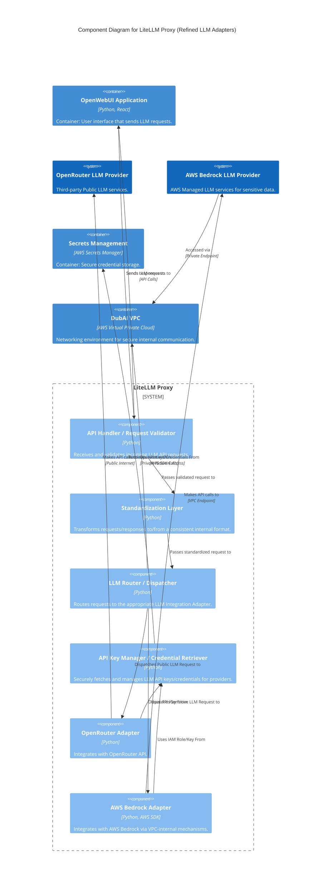

# C4 Level 3: Component Diagram for LiteLLM Proxy

This diagram zooms into the **LiteLLM Proxy** container, which we saw in the Container Diagram. It breaks down this container into its internal, logical components and shows how they interact with each other and with critical external systems, particularly focusing on how it handles connections to different types of Large Language Models.

**Container in Focus:** **`LiteLLM Proxy`**

**Key Components within LiteLLM Proxy and Their Roles:**

*   **`API Handler / Request Validator`:**
    *   **Description:** This is the entry point for all incoming LLM API requests (e.g., from OpenWebUI). It receives these requests, validates their format and any authentication headers, and extracts the necessary parameters for the LLM call.
    *   **Technology:** Python.
*   **`Standardization Layer`:**
    *   **Description:** This crucial component ensures uniformity. It transforms incoming requests from various sources into a consistent internal format that the LiteLLM Proxy understands. Similarly, it transforms responses from LLM providers back into a standardized format before sending them out.
    *   **Technology:** Python.
*   **`LLM Router / Dispatcher`:**
    *   **Description:** This component acts as the traffic controller. Based on the model requested or other criteria, it intelligently decides which specific LLM Integration Adapter (e.g., OpenRouter, AWS Bedrock) should handle the request and dispatches it accordingly.
    *   **Technology:** Python.
*   **`API Key Manager / Credential Retriever`:**
    *   **Description:** This component is responsible for securely obtaining and managing the API keys, IAM roles, or other credentials required to authenticate with different LLM providers. It communicates directly with the external `Secrets Management` service.
    *   **Technology:** Python, AWS SDK.
*   **`OpenRouter Adapter`:**
    *   **Description:** A specific integration module designed to communicate with the **OpenRouter LLM Provider**. It translates internal LiteLLM requests into OpenRouter's specific API format and handles the responses. This is typically used for public LLM interactions.
    *   **Technology:** Python.
*   **`AWS Bedrock Adapter`:**
    *   **Description:** A specific integration module designed to communicate with the **AWS Bedrock LLM Provider**. This adapter is optimized for interaction with AWS's managed LLM services, often involving specific AWS SDK calls and potentially leveraging private network access for sensitive data.
    *   **Technology:** Python, AWS SDK.

**External Systems (relevant to this diagram):**

*   **`OpenWebUI Application` (Container):** The source of LLM requests to the LiteLLM Proxy.
*   **`OpenRouter LLM Provider` (System):** The external public LLM service accessed over the public internet.
*   **`AWS Bedrock LLM Provider` (System):** The AWS managed LLM service designed for sensitive data, accessed potentially via private endpoints within the VPC.
*   **`Secrets Management` (Container):** The service that securely stores the API keys and credentials needed by LiteLLM Proxy's `API Key Manager`.
*   **`DubAI VPC` (Container):** Represents the private network environment within AWS where the DubAI system operates. This is explicitly shown to highlight that `AWS Bedrock LLM Provider` is accessed via the VPC.

**Interactions and Flow:**

1.  **Incoming Request:** The **`OpenWebUI Application`** **`Sends LLM requests to`** the **`API Handler / Request Validator`**.
2.  **Internal Processing:**
    *   The **`API Handler`** **`Passes validated request to`** the **`Standardization Layer`**.
    *   The **`Standardization Layer`** **`Passes standardized request to`** the **`LLM Router / Dispatcher`**.
    *   The **`LLM Router / Dispatcher`** **`Dispatches`** requests to either the **`OpenRouter Adapter`** (for public LLM calls) or the **`AWS Bedrock Adapter`** (for sensitive LLM calls).
3.  **Credential Management:** The **`API Key Manager / Credential Retriever`** **`Retrieves API Keys/Credentials From`** **`Secrets Management`**. Each adapter (OpenRouter, AWS Bedrock) **`Uses API Key/IAM Role From`** the `API Key Manager`.
4.  **External LLM Communication:**
    *   The **`OpenRouter Adapter`** **`Makes API calls to`** the **`OpenRouter LLM Provider`** over the public internet.
    *   The **`AWS Bedrock Adapter`** **`Makes API calls to`** the **`AWS Bedrock LLM Provider`**, specifically via a `VPC Endpoint` within the `DubAI VPC`, emphasizing secure, private access for sensitive data.
5.  **Network Context:** The `LiteLLM Proxy` (implicitly, via its containers and connections) **`Operates within`** the **`DubAI VPC`**, and the **`AWS Bedrock LLM Provider`** is **`Accessed via`** that `Private Endpoint` within the VPC.
6.  **Outgoing Response:** The `API Handler` **`Sends responses to`** the `OpenWebUI Application`.

In essence, this diagram provides a deep dive into how LiteLLM Proxy acts as an intelligent intermediary, routing different types of LLM calls (public vs. sensitive) to appropriate providers while managing credentials and ensuring secure network interactions, particularly for Bedrock.
