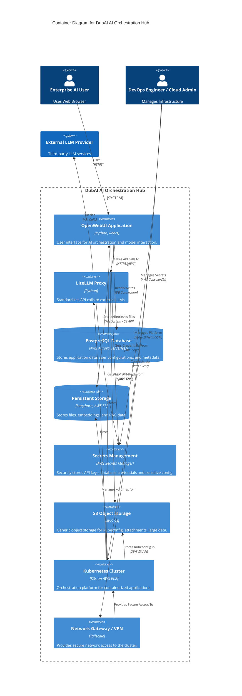

# C4 Level 2: Container Diagram

This diagram provides a more detailed, yet still high-level, view of the DubAI AI Orchestration Hub's architecture. It zooms inside the main "DubAI Platform" system we saw in the Context Diagram and identifies the major "containers." In C4, a container is a deployable, runnable unit, which could be an application, a data store, a microservice, or even a serverless function. It shows the technology choices and how these containers communicate with each other.

**Key Containers and Their Roles:**

*   **`OpenWebUI Application`:** This is the primary web application that users interact with. It's the user interface for all AI orchestration and model interaction. It's built with Python and React and runs as a container.
*   **`LiteLLM Proxy`:** This container acts as an intermediary for all interactions with external Large Language Models (LLMs). It standardizes API calls, routing them efficiently to different LLM providers, and fetches necessary credentials. It's built with Python.
*   **`PostgreSQL Database`:** This is the central relational database for the DubAI platform, storing application data, user configurations, and metadata. It's implemented using AWS Aurora Serverless for scalability and management.
*   **`Persistent Storage`:** This container provides durable storage for files, embeddings, and RAG data. It leverages Longhorn within the Kubernetes cluster, backed by AWS S3 for robust data persistence.
*   **`Secrets Management`:** Implemented using AWS Secrets Manager, this container securely stores, manages, and distributes all sensitive credentials like API keys and database passwords to ensure secure operations.
*   **`S3 Object Storage`:** This provides generic object storage using AWS S3. It's used for various purposes, including storing K3s kubeconfig files, OpenWebUI attachments, and other large unstructured data.
*   **`Kubernetes Cluster`:** This is the container orchestration platform, specifically K3s running on AWS EC2 instances. It hosts and manages the lifecycle of the `OpenWebUI Application`, `LiteLLM Proxy`, and the underlying `Persistent Storage` (Longhorn).
*   **`Network Gateway / VPN`:** Powered by Tailscale, this container provides secure network access to and within the Kubernetes cluster, enabling both internal service communication and controlled access for administrators.

**Interactions and Flow:**

1.  **User Interaction:** The **`Enterprise AI User`** **`Uses`** the **`OpenWebUI Application`** via HTTPS.
2.  **Application Logic:**
    *   **`OpenWebUI Application`** **`Makes API calls to`** **`LiteLLM Proxy`** for all LLM-related tasks.
    *   **`OpenWebUI Application`** **`Reads/Writes`** data to the **`PostgreSQL Database`** and **`Stores/Retrieves files`** from **`Persistent Storage`**.
    *   Both **`OpenWebUI Application`** and **`LiteLLM Proxy`** **`Get Credentials From`** **`Secrets Management`** (e.g., database credentials, external LLM API keys).
    *   **`OpenWebUI Application`** also **`Uses for objects`** **`S3 Object Storage`**.
3.  **LLM Integration:** The **`LiteLLM Proxy`** **`Queries`** the **`External LLM Provider`** to perform AI tasks.
4.  **Platform Hosting:** The **`Kubernetes Cluster`** **`Hosts`** the **`OpenWebUI Application`** and **`LiteLLM Proxy`**, and **`Manages volumes for`** **`Persistent Storage`**. It also **`Stores Kubeconfig in`** **`S3 Object Storage`**.
5.  **Administrative Access:** The **`DevOps Engineer / Cloud Admin`** **`Manages Platform`** via the **`Kubernetes Cluster`**, **`Connects via`** the **`Network Gateway / VPN`**, and **`Manages Secrets`** in **`Secrets Management`**.
6.  **Network Access:** The **`Network Gateway / VPN`** **`Provides Secure Access To`** the **`Kubernetes Cluster`**.

In summary, the Container Diagram details how the DubAI AI Orchestration Hub is composed of these distinct, communicating services and data stores, all orchestrated within a Kubernetes environment and leveraging various AWS managed services for core functionalities like databases, secrets, and object storage.