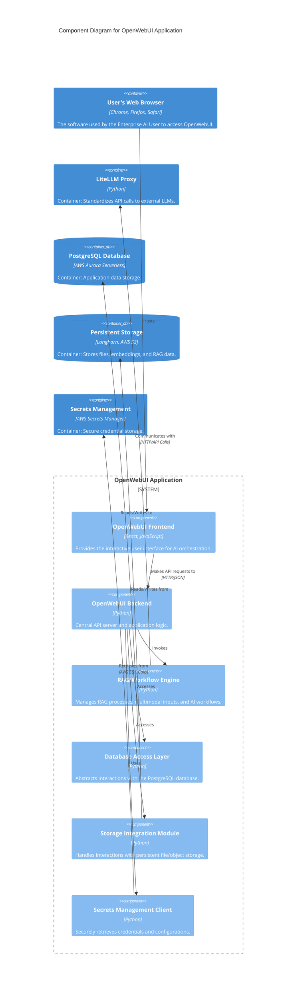

# C4 Level 3: Component Diagram for OpenWebUI Application

This diagram provides a zoomed-in view of the **OpenWebUI Application** container, which we identified in the Container Diagram. It breaks down this single container into its internal, logical components and shows how they interact with each other and with external (to this container) systems. This level is typically for technical audiences familiar with software architecture.

**Container in Focus:** **`OpenWebUI Application`**

**Key Components within OpenWebUI Application and Their Roles:**

*   **`OpenWebUI Frontend`:**
    *   **Description:** This is the part of the application that users see and interact with directly in their web browser. It's responsible for the user interface, displaying chat dialogues, model management tools, and other interactive elements.
    *   **Technology:** React, JavaScript.
*   **`OpenWebUI Backend`:**
    *   **Description:** This is the central server-side application logic. It acts as the API server, processing requests from the frontend, orchestrating the workflow, and communicating with databases and other services.
    *   **Technology:** Python.
*   **`RAG/Workflow Engine`:**
    *   **Description:** A specialized component within the Backend dedicated to complex AI operations like Retrieval Augmented Generation (RAG) and managing broader AI workflows or multimodal inputs. It's where the advanced AI orchestration logic resides.
    *   **Technology:** Python.
*   **`Database Access Layer`:**
    *   **Description:** This component within the Backend is responsible for all interactions with the PostgreSQL database. It abstracts complex database queries and ensures a consistent way for other backend components to read and write data.
    *   **Technology:** Python.
*   **`Storage Integration Module`:**
    *   **Description:** This component within the Backend handles all interactions with file and object storage (like the Persistent Storage and S3 Object Storage). It manages saving and retrieving user files, embedding vectors, or other large data objects.
    *   **Technology:** Python.
*   **`Secrets Management Client`:**
    *   **Description:** A module within the Backend that securely communicates with the external Secrets Management service (AWS Secrets Manager) to retrieve sensitive credentials needed for operations.
    *   **Technology:** Python.

**External Systems (relevant to this diagram):**

*   **`User's Web Browser` (Container):** This is where the `OpenWebUI Frontend` actually runs and is interacted with by the end-user.
*   **`LiteLLM Proxy` (Container):** The external service that the `OpenWebUI Backend` communicates with for all LLM-related requests.
*   **`PostgreSQL Database` (ContainerDb):** The external database where the `OpenWebUI Backend` (via DB Access Layer) stores and retrieves its structured data.
*   **`Persistent Storage` (ContainerDb):** The external storage used by the `OpenWebUI Backend` (via Storage Integration Module) for larger, unstructured data.
*   **`Secrets Management` (Container):** The external service providing secure credentials to the `OpenWebUI Backend` (via Secrets Management Client).

**Interactions and Flow:**

1.  **User Interface:** The **`User's Web Browser`** **`Hosts`** the **`OpenWebUI Frontend`**.
2.  **Frontend-Backend Communication:** The **`OpenWebUI Frontend`** **`Makes API requests to`** the **`OpenWebUI Backend`**.
3.  **Backend Internal Logic:** The **`OpenWebUI Backend`** processes requests:
    *   **`Invokes`** the **`RAG/Workflow Engine`** for complex AI tasks.
    *   **`Accesses`** the **`Database Access Layer`** for database operations.
    *   **`Accesses`** the **`Storage Integration Module`** for file/object storage.
    *   **`Uses`** the **`Secrets Management Client`** to get credentials.
4.  **External Service Interactions:**
    *   The **`RAG/Workflow Engine`** **`Communicates with`** the **`LiteLLM Proxy`** for LLM calls.
    *   The **`Database Access Layer`** **`Reads/Writes to`** the **`PostgreSQL Database`**.
    *   The **`Storage Integration Module`** **`Reads/Writes from`** **`Persistent Storage`**.
    *   The **`Secrets Management Client`** **`Retrieves from`** the **`Secrets Management`** service.

In essence, this diagram provides a detailed decomposition of the OpenWebUI Application, highlighting its internal architecture and showing how its components collaborate to provide the user interface and integrate with various external data stores and services.
