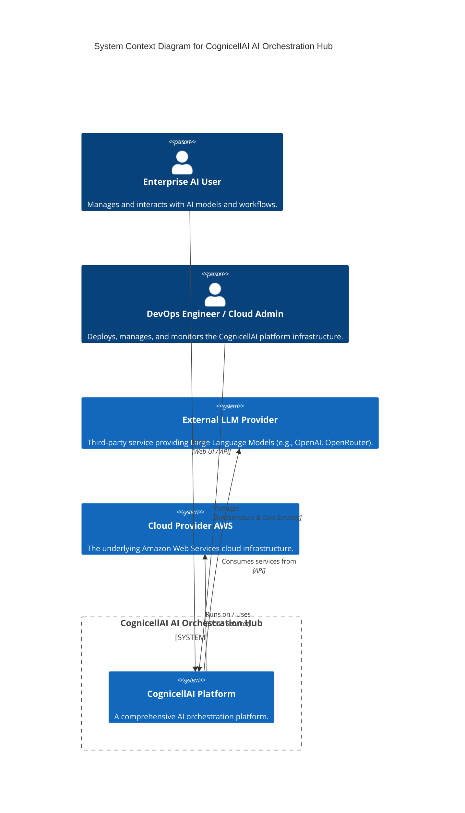

# C4 Level 1: System Context Diagram

This diagram provides the highest-level overview of the CognicellAI AI Orchestration Hub, showing how it fits within its environment. It's intended for any audience, even non-technical stakeholders, to quickly grasp the system's purpose and its external relationships.

Key Components and their Roles:

Enterprise AI User (Person): This is the end-user who interacts with the CognicellAI platform. They utilize the system to manage, orchestrate, and work with various AI models and workflows.

DevOps Engineer / Cloud Admin (Person): This is the technical personnel responsible for the operational aspects of the CognicellAI platform. Their role involves deploying, managing, monitoring, and maintaining the underlying infrastructure and services that CognicellAI runs on.
External LLM Provider (System): This refers to third-party services (e.g., OpenAI, OpenRouter) that provide Large Language Models. The CognicellAI platform sends requests to these providers and receives AI-generated responses from them.
Cloud Provider AWS (System): This represents the Amazon Web Services cloud platform. It serves as the hosting environment for the entire CognicellAI system, providing all the necessary foundational infrastructure components like computing resources, storage, and networking.
CognicellAI AI Orchestration Hub (System Boundary): This encapsulates the entire CognicellAI system, visually representing its clear boundaries and signifying that all components within it collectively form the CognicellAI solution.
CognicellAI Platform (System within Boundary): This represents the core software system of the CognicellAI AI Orchestration Hub. It embodies all the internal functionalities and logic that make CognicellAI an AI orchestration platform.
Interactions and Flow:

The Enterprise AI User Uses the CognicellAI Platform to carry out their tasks, typically through a web-based user interface.
The DevOps Engineer / Cloud Admin Manages the CognicellAI Platform, ensuring its proper functioning, deployment, and ongoing maintenance.
The CognicellAI Platform Consumes services from the External LLM Provider to access various AI models and utilize their capabilities.
The CognicellAI Platform Runs on / Uses the Cloud Provider AWS, relying on its infrastructure and managed services.
In essence, this diagram illustrates that CognicellAI serves as a central hub, enabling users to interact with external AI services, all built and operated on the reliable foundation of AWS, with dedicated personnel managing its technical aspects.

